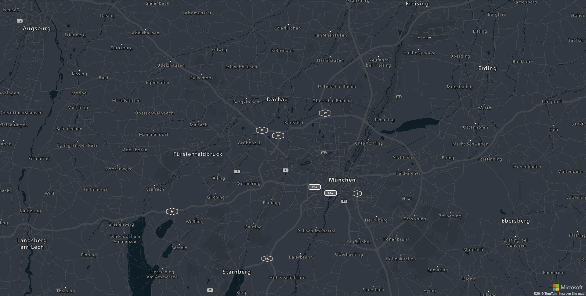
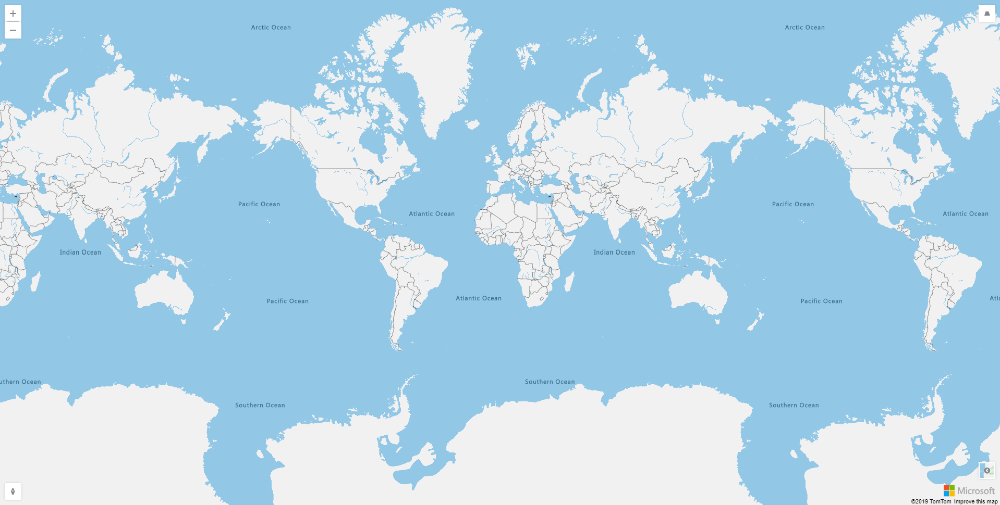

[](https://dev.azure.com/aleclerc/ng-azure-maps/_build/latest?definitionId=15) 
[](https://www.npmjs.com/package/ng-azure-maps)

# ng-azure-maps 

This is a WIP of an Angular wrapper around the azure-maps-control package. It exposes some directives making it easy to integrate azure-maps on an Angular application.


## Register the module

An `AzureMapsModule` can be imported from the `ng-azure-maps` namespace. This class exposes a `forRoot` method which can be called by your angular module and where the configuration of the library can be given.

```
import { BrowserModule } from '@angular/platform-browser';
import { NgModule } from '@angular/core';

import { AppComponent } from './app.component';
import { AzureMapsModule } from 'ng-azure-maps';
import { environment } from '../environments/environment';

@NgModule({
  declarations: [
    AppComponent
  ],
  imports: [
    BrowserModule,
    AzureMapsModule.forRoot({
      authOptions: environment.authOptions
    })
  ],
  providers: [],
  bootstrap: [AppComponent]
})
export class AppModule { }
```

AAD and SubscriptionKey authentication are supported.

## How to

Please note that all the directives can be used either as html tag or applied to an html element as an attribute tag. For example, the map can be displayed using `<azure-map></azure-map>` or `<div azure-map></div>`.

## Display a map

Use the `azure-map` directive to display a map.

```
<azure-map></azure-map>
```

 

You can specific different inputs on the `azure-map` directive to customize your display. Please refer to the [Azure Maps Web SDK Documentation](https://docs.microsoft.com/en-us/azure/azure-maps/map-create) for more information.

```
<azure-map [center]="[11.47, 48.18]" mapStyle='grayscale_dark'></azure-map>
```

NB: To avoid conflict with the `style` html tag, the style to apply to the map can be found under `mapStyle` instead. The same applied to the `type` of camera which has been renamed to `cameraType`.

```
<azure-map [center]="[11.47, 48.18]" mapStyle='grayscale_dark' [zoom]="10"></azure-map>
```

 

For now, only the `ready` and `error` events are available as Output of the `azure-map` directive.

## Add controls

Compass, pitch, style and zoom controls have their own directive, each of them accepting a position binding.

```
<azure-map>
  <zoom-control position='top-left'></zoom-control>
  <pitch-control position="top-right"></pitch-control>
  <compass-control position="bottom-left"></compass-control>
  <style-control position="bottom-right"></style-control>
</azure-map>
```

 

## HtmlMarkers

You can add HTML Markers to the map using the `html-marker` directive. Please refer to the [Azure Maps Documentation](https://docs.microsoft.com/en-us/azure/azure-maps/map-add-custom-html) concerning the available options. The map and the HTML Markers listen to the changes on the provided markers and will update them accordingly.

```
import { Component, OnInit } from '@angular/core';

@Component({
  selector: 'app-root',
  template: '<azure-map>' +
    '<html-marker *ngFor="let markerPosition of markerPositions" [position]="markerPosition">' +
    '</html-marker>' +
    '</azure-map>',
  styleUrls: ['./app.component.scss']
})
export class AppComponent
  implements OnInit {

  public markerPositions: [number, number][] = [];

  ngOnInit(): void {
    for (let i = 0; i < 10; i++) {
      this.markerPositions.push([i * 5, i * 5]);
    }

  }
}
```

 

## Drawing toolbar

The drawing toolbar can be added using the `drawing-toolbar` directive. 

The `drawingChanged`, `drawingChanging`, `drawingComplete`, `drawingModeChanged` and `drawingStarted` events are available as Output of the directive.

```
<azure-map>
  <drawing-toolbar position="top-right" toolbarStyle="dark"></drawing-toolbar>
</azure-map>
```

NB: To avoid conflict with the `style` html tag, the style to apply to the toolbar can be found under `toolbarStyle` instead.

Please refer to the [Azure Maps Documentation](https://docs.microsoft.com/en-us/azure/azure-maps/map-add-drawing-toolbar) for customization and events.

 

## Layers

The layers are directly linked to the map and one of its datasources. A data source can be added directly as a binding on the `azure-map` directive.

```
<azure-map [dataSources]="[dataSource, dataSourceRed]"></azure-map>
```

### Symbol Layers

A symbol layer can be added using the `symbol-layer` directive. The id of the data source to display on the layer can be specified on the `dataSourceId` binding on the directive.

For more information on the customization of the layer, please refer to the [Azure Maps Documentation](https://docs.microsoft.com/en-us/azure/azure-maps/map-add-pin).

```
import { Component, OnInit } from '@angular/core';
import * as atlas from 'azure-maps-control';

@Component({
  selector: 'app-root',
  template: `
  <azure-map zoom="2" [dataSources]="[dataSource, dataSourceRed]">' +
  '<symbol-layer dataSourceId="blue"></symbol-layer>' +
  '<symbol-layer dataSourceId="red" [iconOptions]="redIconOptions"></symbol-layer>' +
  '</azure-map>`,
  styleUrls: ['./app.component.scss']
})
export class AppComponent
  implements OnInit {

  public dataSource: atlas.source.DataSource;
  public dataSourceRed: atlas.source.DataSource;

  public redIconOptions: atlas.IconOptions = {
    image: 'pin-red'
  };

  public ngOnInit(): void {
    this.dataSource = new atlas.source.DataSource('blue');
    this.dataSourceRed = new atlas.source.DataSource('red');

    for (let i = 0; i < 10; i++) {
      const point = new atlas.Shape(new atlas.data.Point([i * 5, i * 5]));
      this.dataSource.add([point]);
      const redPoint = new atlas.Shape(new atlas.data.Point([i * -5, i * 5]));
      this.dataSourceRed.add([redPoint]);
    }
  }

}
```


